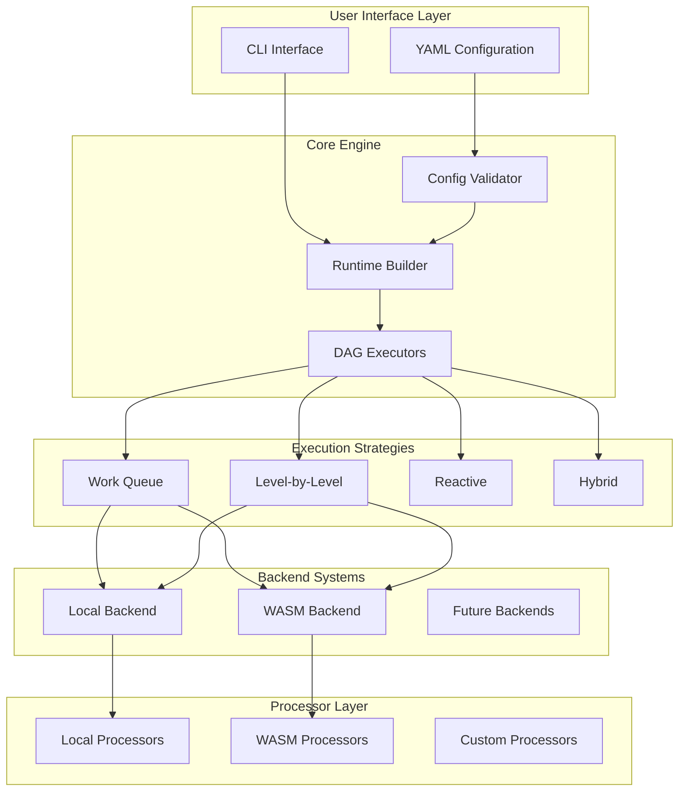

# Architecture Overview

Before diving into the demos, let's understand how The DAGwood project is architected. This chapter provides a comprehensive overview of the system design, key components, and architectural decisions that make DAGwood a robust workflow orchestration platform.

## System Architecture

### High-Level Architecture



### Core Components

#### 1. Configuration System

The configuration system is the entry point for defining workflows:

```rust
// Configuration structure
pub struct Config {
    pub strategy: Strategy,                    // Execution strategy selection
    pub failure_strategy: FailureStrategy,    // Error handling approach
    pub executor_options: ExecutorOptions,    // Runtime configuration
    pub processors: Vec<ProcessorConfig>,     // Processor definitions
}

pub struct ProcessorConfig {
    pub id: String,                           // Unique processor identifier
    pub backend: String,                      // Backend type (local, wasm)
    pub impl_: Option<String>,                // Implementation name
    pub module: Option<String>,               // WASM module path
    pub depends_on: Vec<String>,              // Dependency list
    pub options: HashMap<String, String>,     // Processor-specific options
}
```

**Key Features:**
- **YAML-based**: Human-readable workflow definitions
- **Validation**: Comprehensive validation with detailed error messages
- **Dependency Resolution**: Automatic cycle detection and reference validation
- **Flexible Options**: Processor-specific configuration support

#### 2. Runtime Builder

The Runtime Builder creates execution components from configuration using several key design patterns:

**Design Patterns Used:**
- **Factory Pattern**: Dynamic processor creation based on configuration type
- **Strategy Pattern**: Pluggable execution strategies (WorkQueue, Level-by-Level, Reactive)
- **Builder Pattern**: Fluent configuration construction from YAML

The Runtime Builder transforms YAML configuration into executable components, handling processor instantiation, executor selection, and failure strategy configuration.

#### 3. DAG Execution Engine

The execution engine coordinates workflow execution across different strategies:

```rust
#[async_trait]
pub trait DagExecutor: Send + Sync {
    async fn execute_with_strategy(
        &self,
        processors: HashMap<String, Box<dyn Processor>>,
        dependency_graph: DependencyGraph,
        entry_points: EntryPoints,
        input: ProcessorRequest,
        pipeline_metadata: PipelineMetadata,
        failure_strategy: FailureStrategy,
    ) -> Result<(ExecutionResults, PipelineMetadata), ExecutionError>;
}
```

**Key Responsibilities:**
- **Dependency Resolution**: Topological ordering and cycle detection
- **Concurrency Management**: Parallel execution with configurable limits
- **Error Handling**: Comprehensive failure strategies
- **Metadata Tracking**: Complete audit trail and context preservation

## Execution Strategies

### Work Queue Strategy

The Work Queue strategy maximizes parallelism through dependency counting:

```rust
pub struct WorkQueueExecutor {
    max_concurrency: usize,
}

impl WorkQueueExecutor {
    async fn execute_dag(&self, /* parameters */) -> Result<ExecutionResults, ExecutionError> {
        // 1. Initialize dependency counts
        let mut dependency_counts = self.calculate_dependency_counts(&graph);
        
        // 2. Queue processors with no dependencies
        let mut ready_queue = self.find_ready_processors(&dependency_counts);
        
        // 3. Execute with concurrency control
        let semaphore = Arc::new(Semaphore::new(self.max_concurrency));
        
        while !ready_queue.is_empty() || !active_tasks.is_empty() {
            // Spawn tasks up to concurrency limit
            while !ready_queue.is_empty() && semaphore.available_permits() > 0 {
                let processor_id = ready_queue.pop_front().unwrap();
                let task = self.spawn_processor_task(processor_id, &semaphore);
                active_tasks.push(task);
            }
            
            // Wait for task completion and update dependencies
            let (processor_id, result) = select_completed_task(&mut active_tasks).await;
            self.update_dependencies(processor_id, &mut dependency_counts, &mut ready_queue);
        }
        
        Ok(results)
    }
}
```

**Characteristics:**
- **Maximum Parallelism**: Executes processors as soon as dependencies are satisfied
- **Dynamic Scheduling**: Adapts to irregular DAG structures
- **Memory Efficient**: Uses dependency counting instead of level computation
- **Best For**: Complex DAGs with irregular dependency patterns

### Level-by-Level Strategy

The Level-by-Level strategy executes processors in topological levels:

```rust
pub struct LevelByLevelExecutor {
    max_concurrency: usize,
}

impl LevelByLevelExecutor {
    async fn execute_dag(&self, /* parameters */) -> Result<ExecutionResults, ExecutionError> {
        // 1. Compute topological levels
        let levels = self.compute_topological_levels(&graph)?;
        
        // 2. Execute level by level
        for level in levels {
            // Execute all processors in current level concurrently
            let level_tasks: Vec<_> = level.into_iter()
                .map(|processor_id| self.spawn_processor_task(processor_id))
                .collect();
            
            // Wait for entire level to complete
            let level_results = futures::future::join_all(level_tasks).await;
            
            // Process results and handle errors
            for result in level_results {
                self.process_result(result)?;
            }
        }
        
        Ok(results)
    }
}
```

**Characteristics:**
- **Predictable Execution**: Clear level-by-level progression
- **Simpler State Management**: No complex dependency tracking during execution
- **Level Parallelism**: Full parallelism within each level
- **Best For**: Regular DAGs with clear hierarchical structure

### Reactive Strategy

The Reactive strategy uses event-driven execution for maximum responsiveness:

```rust
pub struct ReactiveExecutor {
    max_concurrency: usize,
}

impl ReactiveExecutor {
    async fn execute_dag(&self, /* parameters */) -> Result<ExecutionResults, ExecutionError> {
        // 1. Create event channels for each processor
        let (senders, receivers) = self.create_event_channels(&graph);
        
        // 2. Spawn processor tasks that wait for dependency events
        for processor_id in graph.processors() {
            let task = self.spawn_reactive_task(processor_id, &receivers, &senders);
            active_tasks.insert(processor_id, task);
        }
        
        // 3. Trigger entry point processors
        for entry_point in entry_points {
            senders[&entry_point].send(ProcessorEvent::Ready)?;
        }
        
        // 4. Event-driven execution - processors notify dependents when complete
        while !active_tasks.is_empty() {
            let (processor_id, result) = select_completed_task(&mut active_tasks).await;
            self.notify_dependents(processor_id, &result, &senders).await;
        }
        
        Ok(results)
    }
}
```

**Characteristics:**
- **Event-Driven**: Processors react immediately to dependency completion
- **Maximum Responsiveness**: No waiting for levels or queue processing
- **Real-Time Execution**: Optimal for low-latency requirements
- **Complex State Management**: Sophisticated event coordination
- **Best For**: I/O-bound processors, real-time workflows, irregular DAGs

### Canonical Payload Architecture

All three strategies use a canonical payload approach for data flow:

```rust
pub struct CanonicalPayloadArchitecture {
    // Single source of truth for data
    canonical_payload: Arc<Mutex<Vec<u8>>>,
    
    // Processor classification
    transform_processors: Vec<String>,  // Modify canonical payload
    analyze_processors: Vec<String>,    // Add metadata only
}

impl CanonicalPayloadArchitecture {
    async fn execute_processor(&self, processor: &dyn Processor) -> ProcessorResponse {
        match processor.declared_intent() {
            ProcessorIntent::Transform => {
                // Transform processors modify the canonical payload
                let mut payload = self.canonical_payload.lock().await;
                let result = processor.process(&*payload).await?;
                if let Some(new_payload) = result.next_payload {
                    *payload = new_payload;
                }
                result
            },
            ProcessorIntent::Analyze => {
                // Analyze processors only add metadata
                let payload = self.canonical_payload.lock().await;
                processor.process(&*payload).await
            },
        }
    }
}
```

**Benefits:**
- **Data Consistency**: Single source of truth prevents data races
- **Clear Semantics**: Transform vs Analyze intent is explicit
- **Metadata Preservation**: Analysis results are preserved without payload modification
- **Race Condition Prevention**: Eliminates non-deterministic execution

## Backend Architecture

### Local Backend

The local backend provides built-in processors with factory-based creation:

```rust
pub struct LocalProcessorFactory;

impl LocalProcessorFactory {
    pub fn create_processor(config: &ProcessorConfig) -> Result<Box<dyn Processor>, ProcessorError> {
        let impl_name = config.impl_.as_deref().unwrap_or("stub");
        
        match impl_name {
            "change_text_case_upper" => Ok(Box::new(ChangeTextCaseProcessor::new(TextCase::Upper))),
            "token_counter" => Ok(Box::new(TokenCounterProcessor::new(config.options.clone()))),
            "word_frequency_analyzer" => Ok(Box::new(WordFrequencyProcessor::new())),
            "prefix_suffix_adder" => Ok(Box::new(PrefixSuffixProcessor::new(config.options.clone()))),
            _ => Err(ProcessorError::UnknownImplementation { name: impl_name.to_string() }),
        }
    }
}
```

**Available Processors:**
- **Text Transformation**: Case conversion, reversal, prefix/suffix addition
- **Text Analysis**: Token counting, word frequency analysis
- **Extensible**: Easy to add new processors through factory pattern

### WASM Backend

The WASM backend provides secure, sandboxed execution:

```rust
pub struct WasmProcessor {
    engine: wasmtime::Engine,
    module: wasmtime::Module,
    store: wasmtime::Store<WasmState>,
}

impl WasmProcessor {
    pub fn new(module_path: &str) -> Result<Self, WasmError> {
        // Create WASM engine with security configuration
        let mut config = wasmtime::Config::new();
        config.wasm_simd(false);           // Disable SIMD for security
        config.wasm_bulk_memory(false);    // Disable bulk memory operations
        config.consume_fuel(true);         // Enable fuel consumption for limits
        
        let engine = wasmtime::Engine::new(&config)?;
        let module = wasmtime::Module::from_file(&engine, module_path)?;
        
        // Create store with resource limits
        let mut store = wasmtime::Store::new(&engine, WasmState::new());
        store.limiter(|state| &mut state.limiter);  // Apply resource limits
        
        Ok(WasmProcessor { engine, module, store })
    }
    
    async fn execute_wasm(&mut self, input: &[u8]) -> Result<Vec<u8>, WasmError> {
        // Create instance with imported functions
        let instance = wasmtime::Instance::new(&mut self.store, &self.module, &[])?;
        
        // Get exported functions
        let process_func = instance.get_typed_func::<(i32,), i32>(&mut self.store, "process")?;
        let allocate_func = instance.get_typed_func::<i32, i32>(&mut self.store, "allocate")?;
        let deallocate_func = instance.get_typed_func::<(i32, i32), ()>(&mut self.store, "deallocate")?;
        
        // Allocate memory in WASM module
        let input_ptr = allocate_func.call(&mut self.store, input.len() as i32)?;
        
        // Copy input data to WASM memory
        let memory = instance.get_memory(&mut self.store, "memory")
            .ok_or(WasmError::MemoryNotFound)?;
        memory.write(&mut self.store, input_ptr as usize, input)?;
        
        // Call WASM function
        let result_ptr = process_func.call(&mut self.store, input_ptr)?;
        
        // Read result from WASM memory
        let result = self.read_cstring_from_memory(&mut self.store, &memory, result_ptr)?;
        
        // Clean up allocated memory
        deallocate_func.call(&mut self.store, (input_ptr, input.len() as i32))?;
        
        Ok(result.into_bytes())
    }
}
```

**Security Features:**
- **Complete Sandboxing**: WASM modules cannot access host system
- **Resource Limits**: CPU and memory consumption limits
- **Controlled Memory Access**: Safe memory management across boundaries
- **Capability-Based Security**: Explicit permissions for host access

## Data Flow Architecture

### Request/Response Flow

```rust
// Data flow through the system
pub struct DataFlow {
    // 1. Input Processing
    input: ProcessorRequest {
        payload: Vec<u8>,  // Raw input data
    },
    
    // 2. Pipeline Metadata
    pipeline_metadata: PipelineMetadata {
        metadata: HashMap<String, ProcessorMetadata>,  // Accumulated context
    },
    
    // 3. Processor Response
    response: ProcessorResponse {
        outcome: Option<Outcome>,           // Transform result or analysis
        metadata: Option<PipelineMetadata>, // Additional context
    },
    
    // 4. Final Results
    results: ExecutionResults {
        processor_results: HashMap<String, ProcessorResponse>,
        final_metadata: PipelineMetadata,
    },
}
```

### Metadata System

The metadata system provides comprehensive context tracking:

```rust
pub struct MetadataSystem {
    // Namespace isolation prevents collisions
    namespaces: HashMap<String, ProcessorMetadata>,
}

impl MetadataSystem {
    pub fn merge_metadata(&mut self, new_metadata: PipelineMetadata) {
        for (processor_id, processor_metadata) in new_metadata.metadata {
            // Collision-resistant merging
            let namespace = format!("{}_{}", processor_id, self.generate_unique_suffix());
            self.namespaces.insert(namespace, processor_metadata);
        }
    }
    
    pub fn get_processor_context(&self, processor_id: &str) -> Option<&ProcessorMetadata> {
        // Retrieve processor-specific context
        self.namespaces.get(processor_id)
    }
}
```

**Features:**
- **Namespace Isolation**: Prevents metadata key collisions
- **Context Preservation**: Complete audit trail of execution
- **Hierarchical Structure**: Nested metadata for complex workflows
- **Serializable**: Protobuf-based for efficient storage and transmission

## Error Handling Architecture

### Comprehensive Error Types

```rust
#[derive(Debug, thiserror::Error)]
pub enum ExecutionError {
    #[error("Configuration validation failed: {message}")]
    ConfigurationError { message: String },
    
    #[error("Processor {processor_id} failed: {source}")]
    ProcessorError { 
        processor_id: String, 
        #[source] source: ProcessorError 
    },
    
    #[error("Dependency cycle detected: {cycle:?}")]
    CyclicDependencyError { cycle: Vec<String> },
    
    #[error("WASM execution failed: {source}")]
    WasmError { #[source] source: WasmError },
}

#[derive(Debug, thiserror::Error)]
pub enum ProcessorError {
    #[error("Validation failed: {message}")]
    ValidationError { message: String },
    
    #[error("Unknown implementation: {name}")]
    UnknownImplementation { name: String },
    
    #[error("WASM module error: {message}")]
    WasmModuleError { message: String },
}
```

### Failure Strategies

```rust
pub enum FailureStrategy {
    FailFast,        // Stop on first error
    ContinueOnError, // Continue with remaining processors
    BestEffort,      // Attempt recovery and partial results
}

impl FailureStrategy {
    pub async fn handle_processor_failure(
        &self,
        processor_id: &str,
        error: ProcessorError,
        context: &ExecutionContext,
    ) -> FailureAction {
        match self {
            FailureStrategy::FailFast => FailureAction::AbortExecution,
            FailureStrategy::ContinueOnError => FailureAction::SkipProcessor,
            FailureStrategy::BestEffort => {
                // Attempt recovery or provide default result
                if let Some(recovery) = self.attempt_recovery(processor_id, &error, context).await {
                    FailureAction::UseRecoveryResult(recovery)
                } else {
                    FailureAction::SkipProcessor
                }
            }
        }
    }
}
```

## Performance Architecture

### Concurrency Management

Each executor implements concurrency control using tokio's Semaphore:

```rust
// From WorkQueueExecutor - actual implementation
impl WorkQueueExecutor {
    async fn execute_with_strategy(/* ... */) -> Result<ExecutionResults, ExecutionError> {
        // Create semaphore for concurrency control
        let semaphore = Arc::new(tokio::sync::Semaphore::new(self.max_concurrency));
        
        // Process work queue with concurrency limits
        while !work_queue.is_empty() {
            // Acquire permit before spawning task
            let permit = semaphore.clone().acquire_owned().await
                .map_err(|_| ExecutionError::InternalError { 
                    message: "Failed to acquire semaphore permit".to_string() 
                })?;
            
            let processor_id = work_queue.pop().unwrap().processor_id;
            
            // Spawn processor task with permit
            let task_handle = tokio::spawn(async move {
                let _permit = permit; // Permit released when task completes
                // Execute processor...
            });
            
            active_tasks.insert(processor_id, task_handle);
        }
    }
}
```

**Real Implementation Features:**
- **Semaphore-based limits**: `tokio::sync::Semaphore` controls concurrent executions
- **Permit-based execution**: Tasks acquire permits before running
- **Automatic cleanup**: Permits released when tasks complete
- **Configurable concurrency**: `max_concurrency` parameter sets limits

### Memory Management

The DAGwood implementation uses several key memory management patterns:

#### Canonical Payload Architecture
- **Single Source of Truth**: One canonical payload flows through the DAG
- **Transform vs Analyze**: Only Transform processors can modify the canonical payload
- **Race Condition Prevention**: Eliminates non-deterministic behavior in diamond patterns
- **Arc<Mutex<T>>**: Thread-safe shared ownership for concurrent access

#### Memory Optimization Patterns
- **Arc Sharing**: Reference counting for large payloads instead of cloning
- **Lazy Cloning**: Clone only when ownership transfer is required
- **Efficient Metadata**: Collision-resistant namespacing for metadata keys

## Extensibility Architecture

### Design Patterns for Extensibility

The DAGwood project uses several key patterns to enable extensibility:

#### Factory Pattern
- **Processor Creation**: Dynamic instantiation based on configuration
- **Backend Abstraction**: Pluggable processor backends (Local, WASM)
- **Type Safety**: Compile-time guarantees for processor interfaces

#### Strategy Pattern  
- **Execution Strategies**: Pluggable DAG execution algorithms
- **Failure Handling**: Configurable error handling strategies
- **Backend Selection**: Runtime selection of processor backends

#### Trait System
- **Processor Trait**: Common interface for all processor implementations
- **DagExecutor Trait**: Common interface for execution strategies
- **Intent Declaration**: Transform vs Analyze processor classification

## Key Architectural Decisions

### ADR Summary

The architecture reflects several key decisions documented in the project ADRs:

1. **Language Choice (Rust)**: Memory safety, performance, and excellent async support
2. **Canonical Payload**: Single source of truth prevents race conditions
3. **Strategy Pattern**: Pluggable execution strategies for different use cases
4. **WASM Sandboxing**: Security through complete isolation
5. **Protobuf Serialization**: Efficient, cross-language data exchange
6. **Factory Pattern**: Extensible processor creation
7. **Semaphore Concurrency**: Configurable parallelism with resource limits

### Design Principles

```rust
pub struct ArchitecturalPrinciples {
    // Core principles guiding the design
    safety_first: "Memory safety and security are non-negotiable",
    performance_by_design: "Efficient algorithms and zero-cost abstractions",
    extensibility: "Plugin architecture for custom backends and processors",
    observability: "Complete audit trails and performance metrics",
    simplicity: "Complex internals, simple external interfaces",
    reliability: "Comprehensive error handling and recovery strategies",
}
```

## Next Steps

Now that you understand the architecture, you're ready to see it in action! The following demos will show how these components work together to execute real workflows, from simple single-processor tasks to complex multi-backend pipelines.

The architecture provides:
- **Flexibility**: Multiple execution strategies for different use cases
- **Security**: Complete WASM sandboxing with resource limits
- **Performance**: Efficient parallel execution with configurable concurrency
- **Extensibility**: Plugin architecture for custom processors and backends
- **Reliability**: Comprehensive error handling and recovery mechanisms

---

> 🏗️ **Architecture Philosophy**: The DAGwood architecture prioritizes safety, performance, and extensibility. Every component is designed to be both powerful and secure, with clear separation of concerns and well-defined interfaces. This foundation enables complex workflow orchestration while maintaining system reliability and developer productivity.
