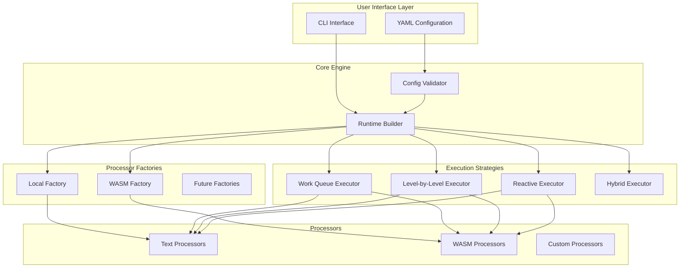

# Architecture Overview

Before diving into the demos, let's understand how The DAGwood project is architected. This chapter provides a comprehensive overview of the system design, key components, and architectural decisions that make DAGwood a robust pipeline orchestration platform.

## System Architecture

### High-Level Architecture

### Core Components

#### 1. Configuration System

The configuration system serves as the entry point for defining pipelines through YAML files.

**Key Features:**
- **YAML-based**: Human-readable pipeline definitions with strategy selection, failure handling, and processor specifications
- **Validation**: Comprehensive validation with cycle detection and reference resolution
- **Flexible Options**: Processor-specific configuration support with backend selection
- **Dependency Management**: Automatic dependency graph construction and validation

#### 2. Runtime Builder

The Runtime Builder orchestrates the creation of all execution components from configuration:

**Key Responsibilities:**
- **Processor Instantiation**: Creates processor instances using appropriate factories (Local, WASM)
- **Executor Selection**: Chooses execution strategy based on configuration (WorkQueue, Level-by-Level, Reactive)
- **Dependency Graph Construction**: Builds internal graph representation from processor dependencies
- **Failure Strategy Configuration**: Sets up error handling behavior (FailFast, ContinueOnError, BestEffort)
- **Concurrency Management**: Configures parallelism limits and resource constraints
- **Validation Integration**: Ensures all processors and dependencies are valid before execution

The Runtime Builder acts as the central orchestrator, transforming declarative YAML into a fully configured, executable DAG system.

#### 3. DAG Execution Engine

The execution engine coordinates pipeline execution across different strategies through a common trait interface.

**Key Responsibilities:**
- **Dependency Resolution**: Topological ordering and cycle detection for safe execution
- **Concurrency Management**: Parallel execution with configurable limits and resource control
- **Error Handling**: Comprehensive failure strategies (FailFast, ContinueOnError, BestEffort)
- **Metadata Tracking**: Complete audit trail and context preservation throughout execution

#### 4. Processors

Processors are the fundamental units of computation in DAGwood, implementing the actual data transformation and analysis logic.

**Key Responsibilities:**
- **Data Processing**: Transform or analyze input data according to processor-specific logic
- **Metadata Generation**: Produce structured metadata about processing results and context
- **Error Handling**: Report failures with detailed error information for debugging
- **Intent Declaration**: Specify whether the processor transforms data or only analyzes it (Transform vs Analyze)

**Processor Types:**
- **Transform Processors**: Modify the canonical payload (e.g., text case conversion, formatting)
- **Analyze Processors**: Extract information without modifying data (e.g., word counting, analysis) 

**Processor Implementations:**
- **Local Processors**: Built-in implementations for common text processing tasks
- **WASM Processors**: Sandboxed modules for secure, multi-language processing
- **RPC Processors**: (Not Yet Implemented) Remote execution through gRPC / HTTP 

**Backend Integration:**
- **Local Backend**: Direct Rust implementations with zero-overhead execution, compiled into binary
- **WASM Backend**: Secure sandboxed execution with wasmtime runtime

> **Note**: The current built-in processors assume a text payload, but the execution engine makes no assumptions about the payload type.

## Execution Strategies

### Work Queue Strategy

The Work Queue strategy maximizes parallelism through dependency counting and priority-based scheduling.

**Algorithm Overview:**
- **Dependency Counting**: Tracks unresolved dependencies for each processor
- **Priority Queue**: Orders processors by topological rank and intent (Transform > Analyze)
- **Dynamic Execution**: Processors execute immediately when dependencies complete
- **Concurrency Control**: Semaphore-based limits prevent resource exhaustion

**Characteristics:**
- **Maximum Parallelism**: Executes processors as soon as dependencies are satisfied
- **Dynamic Scheduling**: Adapts to irregular DAG structures with optimal resource utilization
- **Memory Efficient**: Uses dependency counting instead of level computation
- **Best For**: Complex DAGs with irregular dependency patterns and CPU-bound processors

### Level-by-Level Strategy

The Level-by-Level strategy executes processors in computed topological levels for predictable execution patterns.

**Algorithm Overview:**
- **Level Computation**: Pre-computes topological levels using Kahn's algorithm
- **Batch Execution**: Executes entire levels concurrently before proceeding
- **Synchronization Points**: Waits for level completion before advancing
- **Resource Management**: Applies concurrency limits within each level

**Characteristics:**
- **Predictable Execution**: Clear level-by-level progression with defined synchronization points
- **Simpler State Management**: No complex dependency tracking during execution
- **Level Parallelism**: Full parallelism within each level, sequential between levels
- **Best For**: Regular DAGs with clear hierarchical structure and predictable execution patterns

### Reactive Strategy

The Reactive strategy uses event-driven execution for maximum responsiveness and real-time processing.

**Algorithm Overview:**
- **Event Channels**: MPSC channels enable processor-to-processor communication
- **Reactive Tasks**: All processors spawn immediately and wait for dependency events
- **Immediate Notification**: Completed processors instantly notify dependents
- **Cancellation Support**: Coordinated shutdown and error propagation

**Characteristics:**
- **Event-Driven**: Processors react immediately to dependency completion events
- **Maximum Responsiveness**: No artificial delays, batching, or synchronization points
- **Real-Time Execution**: Optimal for low-latency requirements and streaming workflows
- **Complex State Management**: Sophisticated event coordination with cancellation tokens
- **Best For**: I/O-bound processors, real-time workflows, and irregular DAGs requiring immediate response

### Canonical Payload Architecture

All three strategies use a canonical payload approach to eliminate race conditions in diamond dependency patterns.

**Core Concept:**
- **Single Source of Truth**: One canonical payload flows through the entire DAG
- **Transform vs Analyze**: Only Transform processors can modify the canonical payload
- **Metadata Separation**: Analyze processors contribute metadata without payload changes
- **Deterministic Execution**: Eliminates race conditions in parallel execution scenarios

**Benefits:**
- **Data Consistency**: Single source of truth prevents data races and non-deterministic behavior
- **Clear Semantics**: Transform vs Analyze intent provides explicit architectural separation
- **Metadata Preservation**: Analysis results are preserved without payload modification
- **Race Condition Prevention**: Eliminates the classic diamond dependency race condition problem

## Backend Architecture

### Local Backend

The local backend provides built-in processors with factory-based creation for native Rust execution.

**Architecture:**
- **Factory Pattern**: Dynamic processor creation based on configuration
- **Native Performance**: Direct Rust execution without sandboxing overhead
- **Extensible Design**: Easy addition of new processors through factory registration
- **Configuration-Driven**: Processor selection and options via YAML configuration

**Available Processors:**
- **Text Transformation**: Case conversion, reversal, prefix/suffix addition
- **Text Analysis**: Token counting, word frequency analysis, pattern matching
- **Configurable Options**: Processor-specific parameters through configuration
- **Error Handling**: Graceful fallback to stub processors for unknown implementations

### WASM Backend

The WASM backend provides secure, sandboxed execution using wasmtime for complete isolation.

**Architecture:**
- **Wasmtime Integration**: Industry-standard WASM runtime with security focus
- **Module Loading**: Dynamic WASM module loading from filesystem
- **Memory Management**: Safe memory allocation and deallocation across boundaries
- **Function Interface**: Standardized C-compatible function signatures

**Security Features:**
- **Complete Sandboxing**: WASM modules cannot access host system resources
- **Resource Limits**: CPU fuel consumption and memory usage limits
- **Controlled Memory Access**: Bounds-checked memory operations
- **Capability-Based Security**: Explicit permissions required for any host access
- **Deterministic Execution**: Same input always produces same output

## Data Flow Architecture

### Request/Response Flow

The system uses a structured data flow with protobuf-based serialization for cross-language compatibility.

**Flow Stages:**
- **Input Processing**: Raw input data wrapped in ProcessorRequest with initial metadata
- **Pipeline Metadata**: Accumulated context from all processors with collision-resistant namespacing
- **Processor Response**: Transform results or analysis metadata with optional payload updates
- **Final Results**: Complete execution results with processor outputs and accumulated metadata

### Metadata System

The metadata system provides comprehensive context tracking with collision-resistant namespacing.

**Key Features:**
- **Namespace Isolation**: Prevents metadata key collisions between processors
- **Context Preservation**: Complete audit trail of execution with processor-specific context
- **Hierarchical Structure**: Nested metadata organization for complex workflows
- **Serializable Format**: Protobuf-based for efficient storage and cross-language transmission
- **Collision-Resistant Merging**: Base64-encoded namespacing prevents key conflicts

## Error Handling Architecture

### Comprehensive Error Types

The system uses structured error types with proper error chaining and context preservation.

**Error Categories:**
- **Configuration Errors**: YAML parsing, validation, and dependency resolution failures
- **Processor Errors**: Individual processor execution failures with context
- **Execution Errors**: DAG execution failures including cycles and resource exhaustion
- **WASM Errors**: Sandboxing, module loading, and runtime failures
- **Validation Errors**: Pre-execution validation failures with detailed messages

### Failure Strategies

Configurable failure handling strategies provide different approaches to error recovery.

**Strategy Types:**
- **FailFast**: Stop execution immediately on first processor failure
- **ContinueOnError**: Skip failed processors and continue with remaining workflow
- **BestEffort**: Attempt recovery with default results or graceful degradation

**Implementation Features:**
- **Context-Aware**: Error handling considers processor dependencies and workflow state
- **Configurable**: Strategy selection via YAML configuration
- **Graceful Degradation**: Partial results when possible with clear failure indication

## Performance Architecture

### Concurrency Management

Each executor implements concurrency control using tokio's Semaphore for resource management.

**Concurrency Features:**
- **Semaphore-based Limits**: `tokio::sync::Semaphore` controls concurrent processor executions
- **Permit-based Execution**: Tasks acquire permits before running, ensuring resource limits
- **Automatic Cleanup**: Permits automatically released when tasks complete
- **Configurable Limits**: `max_concurrency` parameter allows tuning based on system resources
- **Backpressure Handling**: Natural backpressure when semaphore permits are exhausted

### Memory Management

The system uses several key memory management patterns for efficiency and safety.

#### Canonical Payload Architecture
- **Single Source of Truth**: One canonical payload flows through the DAG
- **Transform vs Analyze**: Only Transform processors can modify the canonical payload
- **Race Condition Prevention**: Eliminates non-deterministic behavior in diamond patterns
- **Thread-Safe Access**: Arc<Mutex<T>> provides safe concurrent access to shared state

#### Memory Optimization Patterns
- **Arc Sharing**: Reference counting for large payloads instead of expensive cloning
- **Lazy Cloning**: Clone only when ownership transfer is absolutely required
- **Efficient Metadata**: Base64-encoded namespacing prevents key collisions
- **WASM Memory Isolation**: Separate linear memory spaces for complete sandboxing

## Extensibility Architecture

### Design Patterns for Extensibility

The DAGwood project uses several key patterns to enable extensibility:

#### Factory Pattern
- **Processor Creation**: Dynamic instantiation based on configuration
- **Backend Abstraction**: Pluggable processor backends (Local, WASM)
- **Type Safety**: Compile-time guarantees for processor interfaces

#### Strategy Pattern  
- **Execution Strategies**: Pluggable DAG execution algorithms
- **Failure Handling**: Configurable error handling strategies
- **Backend Selection**: Runtime selection of processor backends

#### Trait System
- **Processor Trait**: Common interface for all processor implementations
- **DagExecutor Trait**: Common interface for execution strategies
- **Intent Declaration**: Transform vs Analyze processor classification

## Key Architectural Decisions

### ADR Summary

The architecture reflects several key decisions documented in the project ADRs:

1. **Language Choice (Rust)**: Memory safety, performance, and excellent async support
2. **Canonical Payload**: Single source of truth prevents race conditions
3. **Strategy Pattern**: Pluggable execution strategies for different use cases
4. **WASM Sandboxing**: Security through complete isolation
5. **Protobuf Serialization**: Efficient, cross-language data exchange
6. **Factory Pattern**: Extensible processor creation
7. **Semaphore Concurrency**: Configurable parallelism with resource limits

### Design Principles

The core principles guiding the DAGwood architecture:

- **Safety First**: Memory safety and security are non-negotiable requirements
- **Performance by Design**: Efficient algorithms and zero-cost abstractions throughout
- **Extensibility**: Plugin architecture enables custom backends and processors
- **Observability**: Complete audit trails and performance metrics for production use
- **Simplicity**: Complex internals hidden behind simple, intuitive external interfaces
- **Reliability**: Comprehensive error handling and recovery strategies for robust operation

## Next Steps

Now that you understand the architecture, you're ready to see it in action! The following demos will show how these components work together to execute real workflows, from simple single-processor tasks to complex multi-backend pipelines.

The architecture provides:
- **Flexibility**: Multiple execution strategies for different use cases
- **Security**: Complete WASM sandboxing with resource limits
- **Performance**: Efficient parallel execution with configurable concurrency
- **Extensibility**: Plugin architecture for custom processors and backends
- **Reliability**: Comprehensive error handling and recovery mechanisms

---

> 🏗️ **Architecture Philosophy**: The DAGwood architecture prioritizes safety, performance, and extensibility. Every component is designed to be both powerful and secure, with clear separation of concerns and well-defined interfaces. This foundation enables complex workflow orchestration while maintaining system reliability and developer productivity.
